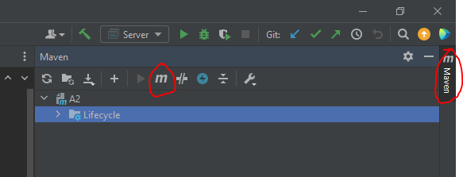
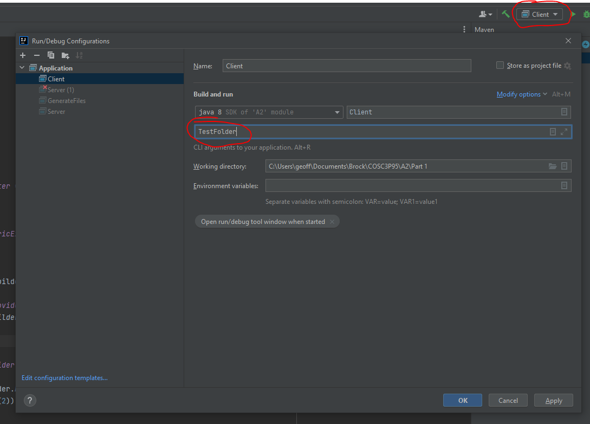

# COSC 3P95 Assignemnt 2

This assignment tasked us with creating a Client-Server program that is intrumented with OpenTelemetry. The program itself involves the Client sending a folder of files to the Sevrer, so we can get experiance with distributed tracing.

## Authours
Geoffrey Jensen (7148710)

Justin Thomas Bijoy (7123550)

## Set Up OpenTelemetry Collector, Jaeger, and Prometheus under Docker

We run our OTEL Collector under Docker, which collects our application's telemetry. It exports the traces to Jaeger for visualization, and the metrics to Prometheus, which are both also running under Docker.

Perform the following steps to run the containers:

1.) Ensure the Docker Daemon is running:

```bash
sudo dockerd
```

2.) Run the configuration file. While in the observability/ directory, run:

```bash
docker compose up
```

The Jaeger UI will now be available at [localhost:16686](http://localhost:16686/).
Prometheus will be available at [localhost:9090](http://localhost:9090/).

While these docker containers are running, they will collect telemetry when the Client-Server application is running.

## Part 1
The first part of the assignment involved writing the inital program, and instrumenting it. The Part 1/ folder contains an IntelliJ project with the following src files:

### Server.java
This is the server program that constantly listens for incoming socket connections. When there is a new connection, it is passed to a thread pool to perform the folder transfer, while the server can continue to listen for new connections.

### FolderTransferRequest.java
This is the runnable class that is executed by the Server's thread pool. It handles the full transfer process of the Client's folder to the Server.

### Client.java
This program is for a single client. It takes the name of the folder to be transerred as a command-line argument, and sends all files within that folder to the Server.

### GenerateFiles.java
This class creates dummy data for testing the Client-Server transfer. It takes in the name of the folder it will place the generated files as a command-line argument.

### Project Setup
The Part 1/ folder is an IntelliJ project. The Java OpenTelemetry library has a lot of dependencies to manage, so we used the Maven build tool. 
After the Part 1/ folder is opened in IntelliJ, you must install the dependencies that are defined in the pom.xml file. To do this, use the Maven tool in IntelliJ. Execute the Maven Goal 'mvn compile'.



Two of the main classes require program arguments to run:

Client.java takes in the name of the folder to transfer as a program argument.

GenerateFiles.java takes in the name of the folder to place the generated files into. If the given folder does not exist, it will be created.

To provide program arguments in IntelliJ, you must edit the run configuration and provide the arguments there:


**Use GenerateFile.java to create test data. Then run Server.java, followed by Client.java. The Server must be running before the Client, or else the Client will timeout and terminate execution.**

## Part 2
The steps to run the main application for Part 2 are the same, except open the Part 2/ folder as its own IntelliJ project, and follow the same steps defined for Part 1.


